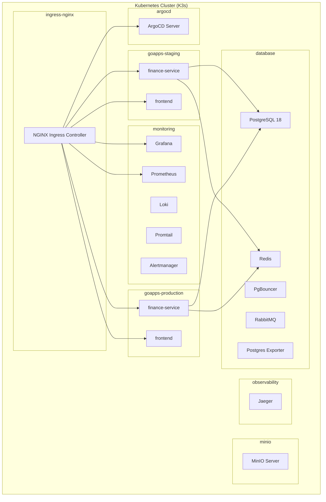

# GoApps Infrastructure (goapps-infra)

Infrastructure as Code (IaC) for **GoApps Microservices Platform** - managing Kubernetes deployments, monitoring, backups, and GitOps.

---

## 📋 Table of Contents

1. [Overview](#overview)
2. [Platform Architecture](#platform-architecture)
3. [Technology Stack](#technology-stack)
4. [Repository Structure](#repository-structure)
5. [Quick Start](#quick-start)
6. [Environment Configuration](#environment-configuration)
7. [Infrastructure Components](#infrastructure-components)
8. [Service Deployment](#service-deployment)
9. [Monitoring & Observability](#monitoring--observability)
10. [Backup & Disaster Recovery](#backup--disaster-recovery)
11. [Security & Secrets Management](#security--secrets-management)
12. [CI/CD Pipeline](#cicd-pipeline)
13. [Troubleshooting](#troubleshooting)
14. [Related Documentation](#related-documentation)

---

## Overview

This repository contains all infrastructure configurations for the GoApps platform, including:

- **Kubernetes Manifests**: Deployments, Services, ConfigMaps, Secrets
- **Kustomize Overlays**: Environment-specific configurations (staging/production)
- **Helm Values**: Configuration for Prometheus, Grafana, Loki, ArgoCD
- **GitOps Workflows**: ArgoCD Applications for auto-sync from Git
- **Automation Scripts**: Bootstrap, monitoring, and maintenance scripts

### GoApps Ecosystem Repositories

```
goapps/
├── goapps-infra/          # 🔧 Infrastructure (this repo)
├── goapps-backend/        # 🖥️  Backend microservices (Go + gRPC)
├── goapps-frontend/       # 🌐 Frontend application (Next.js)
└── goapps-shared-proto/   # 📝 Protocol Buffer definitions
```

| Repository | Description | Tech Stack |
|------------|-------------|------------|
| `goapps-infra` | Infrastructure as Code | Kubernetes, Kustomize, Helm, ArgoCD |
| `goapps-backend` | Microservices APIs | Go, gRPC, PostgreSQL, Redis |
| `goapps-frontend` | Web Application | Next.js 15, React, TypeScript |
| `goapps-shared-proto` | API Contracts | Protocol Buffers, Buf |

---

## Platform Architecture

### High-Level Architecture

```
┌───────────────────────────────────────────────────────────────────────────────┐
│                              goapps Platform                                  │
├───────────────────────────────────────────────────────────────────────────────┤
│                                                                               │
│  ┌─────────────────────────────────────────────────────────────────────────┐  │
│  │                         EXTERNAL ACCESS                                 │  │
│  │  ┌─────────────┐  ┌─────────────┐  ┌─────────────┐  ┌─────────────┐    │  │
│  │  │   HTTPS     │  │   HTTPS     │  │   HTTPS     │  │   gRPC      │    │  │
│  │  │   :443      │  │   :443      │  │   :30090    │  │   :50051    │    │  │
│  │  └──────┬──────┘  └──────┬──────┘  └──────┬──────┘  └──────┬──────┘    │  │
│  └─────────┼────────────────┼────────────────┼────────────────┼───────────┘  │
│            │                │                │                │              │
│  ┌─────────▼────────────────▼────────────────▼────────────────▼───────────┐  │
│  │                    INGRESS LAYER (NGINX)                               │  │
│  │                 TLS Termination + Path-Based Routing                   │  │
│  └─────────────────────────────────────────────────────────────────────────┘  │
│                                      │                                        │
│            ┌─────────────────────────┼─────────────────────────┐              │
│            │                         │                         │              │
│            ▼                         ▼                         ▼              │
│  ┌─────────────────┐      ┌─────────────────┐      ┌─────────────────────┐   │
│  │   APPLICATIONS  │      │   MONITORING    │      │      STORAGE        │   │
│  │                 │      │                 │      │                     │   │
│  │ ┌─────────────┐ │      │ ┌─────────────┐ │      │ ┌─────────────────┐ │   │
│  │ │frontend-svc │ │      │ │  Grafana    │ │      │ │   PostgreSQL    │ │   │
│  │ │ (Next.js)   │ │      │ │  /grafana   │ │      │ │   (Primary DB)  │ │   │
│  │ └─────────────┘ │      │ └─────────────┘ │      │ └─────────────────┘ │   │
│  │ ┌─────────────┐ │      │ ┌─────────────┐ │      │ ┌─────────────────┐ │   │
│  │ │finance-svc  │ │      │ │ Prometheus  │ │      │ │    PgBouncer    │ │   │
│  │ │ (Go/gRPC)   │ │      │ │ /prometheus │ │      │ │   (Pool Conn)   │ │   │
│  │ └─────────────┘ │      │ └─────────────┘ │      │ └─────────────────┘ │   │
│  │ ┌─────────────┐ │      │ ┌─────────────┐ │      │ ┌─────────────────┐ │   │
│  │ │ iam-svc     │ │      │ │    Loki     │ │      │ │      Redis      │ │   │
│  │ │ (future)    │ │      │ │   (Logs)    │ │      │ │    (Caching)    │ │   │
│  │ └─────────────┘ │      │ └─────────────┘ │      │ └─────────────────┘ │   │
│  └─────────────────┘      │ ┌─────────────┐ │      │ ┌─────────────────┐ │   │
│                           │ │ Alertmanager│ │      │ │    RabbitMQ     │ │   │
│  ┌─────────────────┐      │ │   (Email)   │ │      │ │   (Messaging)   │ │   │
│  │     GITOPS      │      │ └─────────────┘ │      │ └─────────────────┘ │   │
│  │                 │      └─────────────────┘      │ ┌─────────────────┐ │   │
│  │ ┌─────────────┐ │                               │ │     MinIO       │ │   │
│  │ │   ArgoCD    │ │      ┌─────────────────┐      │ │ (Object Store)  │ │   │
│  │ │  /argocd    │ │      │   OBSERVABILITY │      │ └─────────────────┘ │   │
│  │ └─────────────┘ │      │                 │      └─────────────────────┘   │
│  └─────────────────┘      │ ┌─────────────┐ │                                │
│                           │ │   Jaeger    │ │                                │
│                           │ │  (Tracing)  │ │                                │
│                           │ └─────────────┘ │                                │
│                           └─────────────────┘                                │
└───────────────────────────────────────────────────────────────────────────────┘
```

### Namespace Architecture



### Data Flow Diagram

```
┌──────────────────────────────────────────────────────────────────────────────┐
│                              REQUEST FLOW                                     │
└──────────────────────────────────────────────────────────────────────────────┘

  User Request
       │
       ▼
  ┌─────────┐     ┌─────────────┐     ┌─────────────┐     ┌─────────────┐
  │  HTTPS  │────▶│   NGINX     │────▶│  Frontend   │────▶│  Backend    │
  │  :443   │     │  Ingress    │     │  (Next.js)  │     │  (gRPC)     │
  └─────────┘     └─────────────┘     └─────────────┘     └─────────────┘
                                                                │
                        ┌───────────────────────────────────────┤
                        │               │               │       │
                        ▼               ▼               ▼       ▼
                  ┌──────────┐   ┌──────────┐   ┌──────────┐ ┌──────────┐
                  │PostgreSQL│   │  Redis   │   │ RabbitMQ │ │  Oracle  │
                  │ (Main DB)│   │ (Cache)  │   │ (Queue)  │ │(External)│
                  └──────────┘   └──────────┘   └──────────┘ └──────────┘
                        │
                        ▼
                  ┌──────────┐
                  │ PgBouncer│ (Connection Pooling)
                  └──────────┘


┌──────────────────────────────────────────────────────────────────────────────┐
│                              BACKUP FLOW                                      │
└──────────────────────────────────────────────────────────────────────────────┘

  ┌──────────────┐      ┌─────────────┐      ┌─────────────┐
  │  PostgreSQL  │─────▶│   MinIO     │─────▶│ Backblaze   │
  │   pg_dump    │      │  (Local S3) │      │ B2 (Cloud)  │
  └──────────────┘      └─────────────┘      └─────────────┘
         │                     │
         ▼                     ▼
  ┌──────────────┐      ┌─────────────┐
  │  VPS Disk    │      │  VPS Disk   │
  │  /mnt/backup │      │  /mnt/backup│
  └──────────────┘      └─────────────┘
```

---

## Technology Stack

### Kubernetes & Orchestration

| Component | Version | Description |
|-----------|---------|-------------|
| K3s | v1.34.x | Lightweight Kubernetes distribution |
| Kustomize | v5.3.0 | Native Kubernetes configuration management |
| Helm | v3.x | Package manager for Kubernetes charts |
| ArgoCD | v7.7.5 | GitOps continuous delivery |

### Database & Storage

| Component | Version | Description |
|-----------|---------|-------------|
| PostgreSQL | 18-alpine | Primary relational database |
| PgBouncer | latest | Connection pooling |
| Redis | 7-alpine | In-memory caching |
| RabbitMQ | 3-management | Message queue |
| MinIO | latest | S3-compatible object storage |

### Monitoring & Observability

| Component | Version | Description |
|-----------|---------|-------------|
| Prometheus | 2.x (via kube-prometheus-stack) | Metrics collection |
| Grafana | 11.x | Visualization & dashboards |
| Loki | 2.x | Log aggregation |
| Promtail | 2.x | Log shipping agent |
| Alertmanager | 0.x | Alert routing & notifications |
| Jaeger | latest | Distributed tracing |

### Networking & Security

| Component | Description |
|-----------|-------------|
| NGINX Ingress Controller | L7 load balancer & TLS termination |
| TLS/SSL | Wildcard certificate (*.mutugading.com) |
| Basic Auth | Prometheus protection (production) |

---

## Repository Structure

```
goapps-infra/
│
├── 📁 base/                          # Base Kustomize resources (shared)
│   ├── argocd/                       # ArgoCD base configuration
│   │   └── kustomization.yaml
│   ├── backup/                       # Backup configurations
│   │   ├── cronjobs/                 # PostgreSQL backup schedules
│   │   │   ├── minio-backup.yaml     # MinIO to VPS backup
│   │   │   └── postgres-backup.yaml  # 3x daily backups
│   │   ├── minio/                    # MinIO deployment
│   │   │   ├── deployment.yaml
│   │   │   └── service.yaml
│   │   └── kustomization.yaml
│   ├── database/                     # Database layer
│   │   ├── exporter/                 # Postgres exporter for metrics
│   │   ├── oracle/                   # Oracle external service config
│   │   ├── pgbouncer/                # Connection pooler
│   │   ├── postgres/                 # PostgreSQL StatefulSet
│   │   ├── rabbitmq/                 # Message queue
│   │   ├── redis/                    # Cache layer
│   │   └── kustomization.yaml
│   ├── ingress/                      # Ingress base configs
│   ├── kubernetes-dashboard/         # K8s Dashboard admin
│   ├── monitoring/                   # Monitoring stack
│   │   ├── alert-rules/              # Grafana alert definitions
│   │   ├── dashboards/               # Grafana dashboard JSONs
│   │   ├── datasources/              # Grafana datasource configs
│   │   └── helm-values/              # Prometheus/Loki Helm values
│   ├── namespaces/                   # Namespace definitions
│   ├── observability/                # Jaeger tracing
│   └── secrets/                      # Secret templates (NOT REAL SECRETS!)
│
├── 📁 overlays/                      # Environment-specific patches
│   ├── staging/                      # Staging environment
│   │   ├── backup/                   # Staging backup paths
│   │   ├── backup-patch.yaml         # Override backup locations
│   │   ├── ingress.yaml              # Staging ingress rules
│   │   └── minio/                    # Staging MinIO config
│   └── production/                   # Production environment
│       ├── backup/                   # Production backup paths
│       ├── backup-patch.yaml         # Override backup locations
│       ├── ingress.yaml              # Production ingress rules
│       └── minio/                    # Production MinIO config
│
├── 📁 services/                      # Application deployments
│   ├── finance-service/              # Finance microservice
│   │   ├── base/                     # Base deployment
│   │   │   ├── deployment.yaml       # Container spec
│   │   │   ├── hpa.yaml              # Auto-scaling
│   │   │   ├── ingress.yaml          # Service ingress
│   │   │   ├── kustomization.yaml
│   │   │   └── service.yaml
│   │   └── overlays/
│   │       ├── staging/              # Staging overrides
│   │       └── production/           # Production overrides
│   └── frontend/                     # Frontend service
│       ├── base/
│       └── overlays/
│
├── 📁 argocd/                        # ArgoCD GitOps configs
│   ├── apps/                         # ArgoCD Application manifests
│   │   ├── shared/                   # Shared apps (database, monitoring)
│   │   ├── staging/                  # Staging-only apps
│   │   └── production/               # Production-only apps
│   └── projects/                     # ArgoCD Projects
│
├── 📁 scripts/                       # Automation scripts
│   ├── bootstrap.sh                  # Initial cluster setup
│   ├── reset-k3s.sh                  # Clean uninstall K3s
│   ├── install-monitoring.sh         # Install Prometheus/Grafana/Loki
│   ├── install-argocd.sh             # Install ArgoCD
│   ├── install-nginx-ingress.sh      # Install NGINX Ingress
│   ├── install-runner.sh             # Install GitHub Actions runner
│   ├── fix-staging.sh                # Staging troubleshooting
│   └── fix-production.sh             # Production troubleshooting
│
├── 📁 docs/                          # Documentation
│   ├── deployment-guide.md           # Step-by-step deployment
│   ├── vps-reset-guide.md            # Complete VPS reset procedure
│   └── runbooks/                     # Operational runbooks
│
├── 📁 .github/                       # GitHub Actions
│   ├── workflows/
│   │   ├── ci.yml                    # Validate manifests & lint
│   │   ├── health-check.yml          # Scheduled health checks
│   │   └── sync-argocd.yml           # ArgoCD sync on push
│   ├── ISSUE_TEMPLATE/               # Issue templates
│   │   ├── bug_report.md
│   │   ├── feature_request.md
│   │   ├── new_service.md
│   │   ├── incident_report.md
│   │   └── config.yml
│   ├── PULL_REQUEST_TEMPLATE.md
│   └── actions/
│       └── argocd-sync/              # Reusable ArgoCD sync action
│
├── .gitignore                        # Git ignore rules
├── .yamllint.yml                     # YAML linting config
├── Makefile                          # Common make targets
├── README.md                         # This file
├── RULES.md                          # Development rules & conventions
├── CONTRIBUTING.md                   # Contribution guidelines
└── LICENSE                           # Proprietary license
```

---

## Quick Start

### Prerequisites

On VPS (Ubuntu 24.04 LTS):
- SSH access with root/sudo
- Disk partition for backup (`/dev/sdb1`)
- SSL certificates (`ssl-bundle.crt`, `mutugading.com.key`)

On local machine:
- Git installed
- kubectl configured

### 1. Clone Repository

```bash
ssh deploy@<vps-hostname>
cd ~
git clone https://github.com/mutugading/goapps-infra.git
cd goapps-infra
chmod +x scripts/*.sh
```

### 2. Bootstrap K3s Cluster

```bash
# Staging VPS
./scripts/bootstrap.sh

# Production VPS
ENVIRONMENT=production ./scripts/bootstrap.sh
```

This script will:
- Install K3s (without Traefik - using NGINX Ingress)
- Install Helm
- Create namespaces: `database`, `monitoring`, `minio`, `argocd`, `goapps-staging/production`
- Install VPA (Vertical Pod Autoscaler)

### 3. Create Secrets

> ⚠️ **IMPORTANT**: Secrets must NOT be committed to Git!

```bash
# PostgreSQL
kubectl create secret generic postgres-secret -n database \
  --from-literal=POSTGRES_USER=goapps_admin \
  --from-literal=POSTGRES_PASSWORD='<STRONG_PASSWORD>' \
  --from-literal=POSTGRES_DB=goapps

# MinIO
kubectl create secret generic minio-secret -n minio \
  --from-literal=MINIO_ROOT_USER=admin \
  --from-literal=MINIO_ROOT_PASSWORD='<STRONG_PASSWORD>'

# Copy MinIO secret to database namespace
kubectl get secret minio-secret -n minio -o yaml | \
  sed 's/namespace: minio/namespace: database/' | \
  kubectl apply -f -

# TLS Certificate
kubectl create secret tls goapps-tls -n monitoring \
  --cert=ssl-bundle.crt \
  --key=mutugading.com.key

# Copy TLS to other namespaces
for ns in argocd ingress-nginx goapps-staging kubernetes-dashboard; do
  kubectl create ns $ns 2>/dev/null || true
  kubectl get secret goapps-tls -n monitoring -o yaml | \
    sed "s/namespace: monitoring/namespace: $ns/" | \
    kubectl apply -f -
done

# Grafana SMTP
kubectl create secret generic grafana-smtp-secret -n monitoring \
  --from-literal=password='<SMTP_PASSWORD>'
```

See [docs/vps-reset-guide.md](docs/vps-reset-guide.md) for complete secrets list.

### 4. Install Monitoring Stack

```bash
export GRAFANA_PASSWORD='your-secure-password'
./scripts/install-monitoring.sh
```

### 5. Apply Base Infrastructure

```bash
# Apply all base configs
kubectl apply -k base/database/
kubectl apply -k base/backup/
kubectl apply -k base/monitoring/alert-rules/
```

### 6. Install ArgoCD

```bash
./scripts/install-argocd.sh
```

### 7. Install NGINX Ingress

```bash
./scripts/install-nginx-ingress.sh
```

### 8. Apply Ingress & ArgoCD Apps

```bash
# Staging
kubectl apply -f overlays/staging/ingress.yaml
kubectl apply -f argocd/apps/staging/
kubectl apply -f argocd/apps/shared/
kubectl apply -f argocd/projects/

# Production
kubectl apply -f overlays/production/ingress.yaml
kubectl apply -f argocd/apps/production/
kubectl apply -f argocd/apps/shared/
kubectl apply -f argocd/projects/
```

### 9. Verify Installation

```bash
make status
```

---

## Environment Configuration

### Staging vs Production

| Aspect | Staging | Production |
|--------|---------|------------|
| **VPS Specs** | 4 core, 8GB RAM | 8 core, 16GB RAM |
| **Domain** | staging-goapps.mutugading.com | goapps.mutugading.com |
| **Backup Mount** | `/staging-goapps-backup` | `/goapps-backup` |
| **ArgoCD Sync** | Automatic | Manual approval |
| **Prometheus Auth** | No auth | Basic Auth required |
| **Namespace** | `goapps-staging` | `goapps-production` |

### Access URLs

#### Staging
| Service | URL |
|---------|-----|
| Grafana | https://staging-goapps.mutugading.com/grafana |
| Prometheus | https://staging-goapps.mutugading.com/prometheus |
| ArgoCD | https://staging-goapps.mutugading.com/argocd |
| MinIO Console | https://staging-goapps.mutugading.com:30090 |

#### Production
| Service | URL |
|---------|-----|
| Grafana | https://goapps.mutugading.com/grafana |
| Prometheus | https://goapps.mutugading.com/prometheus |
| ArgoCD | https://goapps.mutugading.com/argocd |
| MinIO Console | https://goapps.mutugading.com:30090 |

---

## Infrastructure Components

### Database Layer

#### PostgreSQL 18

- **Location**: `base/database/postgres/`
- **Type**: StatefulSet with 20Gi PVC
- **Access**: `postgres.database.svc.cluster.local:5432`

```yaml
# Schemas created automatically:
- finance    # Finance service data
- (future schemas added in init-schemas.sql)
```

#### PgBouncer

- **Location**: `base/database/pgbouncer/`
- **Mode**: Transaction pooling
- **Pool Size**: 100 connections
- **Access**: `pgbouncer.database.svc.cluster.local:5432`

#### Redis

- **Location**: `base/database/redis/`
- **Purpose**: Session cache, rate limiting
- **Access**: `redis.database.svc.cluster.local:6379`

#### RabbitMQ

- **Location**: `base/database/rabbitmq/`
- **Purpose**: Async message queue
- **Access**: `rabbitmq.database.svc.cluster.local:5672`
- **Management UI**: Port 15672

### Storage Layer

#### MinIO (S3-Compatible)

- **Location**: `base/backup/minio/`
- **Purpose**: Local object storage for backups
- **Access**: `minio.minio.svc.cluster.local:9000` (API), `:9001` (Console)
- **TLS**: Enabled via NodePort 30090

### Ingress Layer

#### NGINX Ingress Controller

- **Installation**: `scripts/install-nginx-ingress.sh`
- **Purpose**: L7 load balancing, TLS termination, path-based routing
- **Configuration**: `overlays/{staging,production}/ingress.yaml`

---

## Service Deployment

### Service Deployment Pattern

Each service follows the Kustomize base + overlays pattern:

```
services/<service-name>/
├── base/
│   ├── deployment.yaml      # Container spec
│   ├── service.yaml         # K8s Service
│   ├── hpa.yaml             # HorizontalPodAutoscaler
│   ├── ingress.yaml         # Optional ingress rules
│   └── kustomization.yaml   # Kustomize config
└── overlays/
    ├── staging/
    │   ├── kustomization.yaml
    │   └── patches/
    └── production/
        ├── kustomization.yaml
        └── patches/
```

### Finance Service

**Base Configuration** (`services/finance-service/base/`):

```yaml
Ports:
  - containerPort: 50051  # gRPC
  - containerPort: 8080   # HTTP
  - containerPort: 8090   # Metrics (/metrics)

Resources:
  Requests: 128Mi memory, 100m CPU
  Limits: 512Mi memory, 500m CPU

HPA:
  Min: 1, Max: 5 replicas
  Target CPU: 70%

Environment Variables:
  - DATABASE_HOST: postgres.database.svc.cluster.local
  - REDIS_HOST: redis.database.svc.cluster.local
  - JAEGER_ENDPOINT: jaeger-collector.monitoring.svc.cluster.local:4317
```

### Deploy New Service

See [RULES.md](./RULES.md) for complete guide on adding new services.

```bash
# 1. Create directory structure
mkdir -p services/new-service/{base,overlays/{staging,production}}

# 2. Copy template from finance-service
cp -r services/finance-service/base/* services/new-service/base/

# 3. Update manifests (image, ports, env)
# Edit services/new-service/base/deployment.yaml

# 4. Create ArgoCD Application
cat > argocd/apps/staging/new-service.yaml << EOF
apiVersion: argoproj.io/v1alpha1
kind: Application
metadata:
  name: new-service-staging
  namespace: argocd
spec:
  project: goapps
  source:
    repoURL: https://github.com/mutugading/goapps-infra.git
    targetRevision: main
    path: services/new-service/overlays/staging
  destination:
    server: https://kubernetes.default.svc
    namespace: goapps-staging
  syncPolicy:
    automated:
      prune: true
      selfHeal: true
EOF

# 5. Commit and push
git add . && git commit -m "feat: add new-service" && git push
```

---

## Monitoring & Observability

### Prometheus

- **Retention**: 30 days
- **Storage**: 20Gi PVC
- **Sub-path**: `/prometheus`
- **Basic Auth**: Production only

### Grafana

- **Persistence**: 10Gi PVC
- **Sub-path**: `/grafana`
- **SMTP**: Email alerts via mgtalert@mutugading.com

#### Available Dashboards

| Dashboard | File | Description |
|-----------|------|-------------|
| Go Apps Overview | `grafana-dashboard-go-apps.json` | Service metrics, HPA status |
| PostgreSQL | `grafana-dashboard-postgres.json` | Database performance |
| Loki Logs | `grafana-dashboard-loki.json` | Centralized logging |

### Alert Categories

| Category | Alert Examples |
|----------|----------------|
| Node Health | High CPU/Memory/Disk usage |
| Pod Status | CrashLoopBackOff, High restart count |
| HPA Scaling | Reached max replicas |
| PVC Storage | Volume nearly full |
| PostgreSQL | Connection pool exhausted, Slow queries |
| Backup | Backup job failed, Old backups |

### Jaeger Tracing

- **Namespace**: `observability`
- **Collector**: `jaeger-collector.monitoring.svc.cluster.local:4317`
- **Access**: Port-forward to localhost:16686

---

## Backup & Disaster Recovery

### Backup Strategy

```
┌──────────────────────────────────────────────────────────────────────────┐
│                           BACKUP STRATEGY                                │
├──────────────┬──────────────────┬────────────┬──────────────┬───────────┤
│    Target    │   Destination    │  Schedule  │  Retention   │   Type    │
├──────────────┼──────────────────┼────────────┼──────────────┼───────────┤
│ PostgreSQL   │ MinIO (Local)    │ 3x daily   │ 7 days       │ pg_dump   │
│ PostgreSQL   │ Backblaze B2     │ 3x daily   │ 7 days       │ pg_dump   │
│ PostgreSQL   │ VPS Disk         │ 3x daily   │ 7 days       │ pg_dump   │
│ MinIO        │ VPS Disk only    │ Daily      │ 7 days       │ mc mirror │
└──────────────┴──────────────────┴────────────┴──────────────┴───────────┘
```

### Backup Schedule

| CronJob | Time (WIB) | Timezone |
|---------|------------|----------|
| `postgres-backup-morning` | 06:00 | Asia/Jakarta |
| `postgres-backup-afternoon` | 14:00 | Asia/Jakarta |
| `postgres-backup-night` | 22:00 | Asia/Jakarta |
| `minio-backup` | 03:00 | Asia/Jakarta |

### Backup Locations

| Environment | VPS Path | MinIO Bucket |
|-------------|----------|--------------|
| Staging | `/staging-goapps-backup/postgres` | `postgres-backups` |
| Production | `/goapps-backup/postgres` | `postgres-backups` |

### Manual Backup

```bash
# Trigger backup manually
make backup-now

# Or directly
kubectl create job --from=cronjob/postgres-backup-morning \
  postgres-backup-manual-$(date +%Y%m%d%H%M%S) -n database
```

### Restore Procedure

```bash
# 1. List available backups
ls -la /mnt/goapps-backup/postgres/
# or
mc ls minio/postgres-backups/

# 2. Copy backup to pod
kubectl cp <backup-file>.sql.gz database/postgres-0:/tmp/

# 3. Restore
kubectl exec -it postgres-0 -n database -- bash -c "
  gunzip -c /tmp/<backup-file>.sql.gz | psql -U postgres -d goapps
"
```

---

## Security & Secrets Management

### Secrets Checklist

| Secret Name | Namespace | Required Keys |
|-------------|-----------|---------------|
| `postgres-secret` | database | POSTGRES_USER, POSTGRES_PASSWORD, POSTGRES_DB |
| `minio-secret` | minio, database | MINIO_ROOT_USER, MINIO_ROOT_PASSWORD |
| `rabbitmq-secret` | database | RABBITMQ_USER, RABBITMQ_PASSWORD |
| `oracle-credentials` | goapps-* | ORACLE_HOST, ORACLE_PORT, ORACLE_*_USER, ORACLE_*_PASSWORD |
| `goapps-tls` | multiple | tls.crt, tls.key |
| `grafana-admin-secret` | monitoring | admin-user, admin-password |
| `grafana-smtp-secret` | monitoring | password |
| `s3-cloud-credentials` | database | S3_ENDPOINT, S3_BUCKET, AWS_ACCESS_KEY_ID, AWS_SECRET_ACCESS_KEY |
| `ghcr-secret` | goapps-* | Docker registry credentials |
| `prometheus-basic-auth` | monitoring | auth (htpasswd format) |

### Security Rules

1. **Never commit secrets to Git** - Use `kubectl create secret` manually
2. **Use separate passwords per environment** - Staging ≠ Production
3. **Rotate credentials regularly** - Especially for production
4. **Limit secret access** - Use RBAC appropriately
5. **Monitor secret access** - Enable audit logging

---

## CI/CD Pipeline

### GitHub Actions Workflows

#### 1. CI Workflow (`ci.yml`)

Triggers: Push to `main`/`develop`, PRs to `main`

Steps:
1. Validate base kustomizations
2. Validate staging/production overlays
3. Validate service manifests
4. Lint YAML files (yamllint)
5. Security scan (Trivy)

#### 2. ArgoCD Sync (`sync-argocd.yml`)

Triggers: Push to `main` (paths: base/**, overlays/**, services/**, argocd/**)

Steps:
1. Sync staging applications (automatic)
2. Sync production applications (manual dispatch only)
3. Wait for applications to be healthy

#### 3. Health Check (`health-check.yml`)

Triggers: Scheduled (cron), manual dispatch

Steps:
1. Check cluster connectivity
2. Verify critical pods status
3. Report health status

### Self-Hosted Runners

Runner labels:
- `staging`: Runs on staging VPS
- `production`: Runs on production VPS  
- `goapps-runner`: Common label for all runners

Install runner:
```bash
./scripts/install-runner.sh
```

---

## Troubleshooting

### Common Issues & Solutions

#### Pod CrashLoopBackOff

```bash
# Check pod events
kubectl describe pod <pod-name> -n <namespace>

# Check previous logs
kubectl logs <pod-name> -n <namespace> --previous
```

#### Database Connection Issues

```bash
# Test PostgreSQL directly
kubectl exec -it postgres-0 -n database -- \
  psql -U goapps_admin -d goapps -c "SELECT 1"

# Test via PgBouncer
kubectl run test-pg --rm -it --image=postgres:18-alpine -- \
  psql -h pgbouncer.database -U goapps_admin -d goapps
```

#### Ingress Not Working

```bash
# Check ingress status
kubectl get ingress -A
kubectl describe ingress <name> -n <namespace>

# Check NGINX controller logs
kubectl logs -n ingress-nginx -l app.kubernetes.io/name=ingress-nginx
```

#### ArgoCD Sync Failed

```bash
# Get ArgoCD password
kubectl -n argocd get secret argocd-initial-admin-secret \
  -o jsonpath="{.data.password}" | base64 -d

# Check application status
kubectl get applications -n argocd

# Force sync
argocd app sync <app-name> --force
```

#### Storage Issues

```bash
# Check PVC status
kubectl get pvc -A

# Check PV status
kubectl get pv

# Describe PVC
kubectl describe pvc <pvc-name> -n <namespace>
```

### Useful Commands

```bash
# Cluster overview
make status

# PostgreSQL logs
make logs-postgres

# ArgoCD logs
make logs-argocd

# Port forward Grafana
make port-forward-grafana

# Port forward ArgoCD
make port-forward-argocd

# Validate manifests
make lint

# Manual backup
make backup-now
```

---

## Related Documentation

| Document | Path | Description |
|----------|------|-------------|
| Development Rules | [RULES.md](./RULES.md) | Conventions and guidelines |
| Contributing Guide | [CONTRIBUTING.md](./CONTRIBUTING.md) | How to contribute |
| Deployment Guide | [docs/deployment-guide.md](./docs/deployment-guide.md) | Step-by-step deployment |
| VPS Reset Guide | [docs/vps-reset-guide.md](./docs/vps-reset-guide.md) | Complete VPS reset |
| License | [LICENSE](./LICENSE) | Proprietary license |

### Issue Templates

| Template | Description |
|----------|-------------|
| [🐛 Bug Report](.github/ISSUE_TEMPLATE/bug_report.md) | Report bugs or infrastructure issues |
| [✨ Feature Request](.github/ISSUE_TEMPLATE/feature_request.md) | Request new features or enhancements |
| [🚀 New Service](.github/ISSUE_TEMPLATE/new_service.md) | Request deployment for new service |
| [🚨 Incident Report](.github/ISSUE_TEMPLATE/incident_report.md) | Report production incidents |

### Pull Request Template

All PRs use the standard template: [PULL_REQUEST_TEMPLATE.md](.github/PULL_REQUEST_TEMPLATE.md)

---

## Support & Contact

- **Team**: GoApps DevOps
- **Organization**: PT Mutu Gading Tekstil
- **Repository Issues**: [GitHub Issues](https://github.com/mutugading/goapps-infra/issues)

---

## License

This project is proprietary software. See the [LICENSE](./LICENSE) file for details.

**© 2024-2026 PT Mutu Gading Tekstil. All Rights Reserved.**
