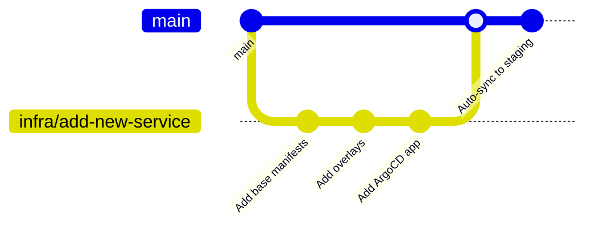

# Infrastructure Development Rules

Guidelines and rules for all developers working with `goapps-infra`.

---

## 📋 Table of Contents

1. [Golden Rules](#golden-rules)
2. [Naming Conventions](#naming-conventions)
3. [Directory Structure Rules](#directory-structure-rules)
4. [Kustomize Patterns](#kustomize-patterns)
5. [Adding New Service](#adding-new-service)
6. [Database Management](#database-management)
7. [Monitoring Configuration](#monitoring-configuration)
8. [Backup Management](#backup-management)
9. [Security Policies](#security-policies)
10. [Git Workflow](#git-workflow)
11. [Emergency Procedures](#emergency-procedures)
12. [Checklists](#checklists)

---

## Golden Rules

> ⚠️ **Rules that MUST NOT be violated!**

### 1. Never Commit Secrets

```bash
# ❌ WRONG - Never do this!
git add secrets/production-credentials.yaml

# ✅ CORRECT - Create secrets manually in cluster
kubectl create secret generic postgres-secret -n database \
  --from-literal=POSTGRES_PASSWORD='<password>'
```

### 2. Always Test in Staging First

```bash
# ✅ Correct order:
1. Deploy to staging
2. Verify in staging (minimum 24 hours)
3. Deploy to production (with approval)
```

### 3. Document All Changes

- Update README for architecture changes
- Create/update runbooks for new procedures
- Comment on PRs for non-obvious changes

### 4. Use Kustomize Overlays

```bash
# ❌ WRONG - Don't duplicate manifests
services/new-service/staging/deployment.yaml
services/new-service/production/deployment.yaml

# ✅ CORRECT - Use base + overlays + patches
services/new-service/
├── base/
│   └── deployment.yaml
└── overlays/
    ├── staging/
    │   └── patches/replicas.yaml
    └── production/
        └── patches/replicas.yaml
```

### 5. Follow Naming Conventions

Consistent naming is essential for:
- Debugging and troubleshooting
- ArgoCD application matching
- Monitoring and alerting
- Documentation

---

## Naming Conventions

### Kubernetes Resources

| Resource | Pattern | Example |
|----------|---------|---------|
| Namespace | `<purpose>` or `<app>-<env>` | `database`, `monitoring`, `goapps-staging` |
| Deployment | `<service-name>` | `finance-service`, `frontend` |
| StatefulSet | `<app-name>` | `postgres`, `rabbitmq` |
| Service | `<deployment-name>` | `finance-service`, `postgres` |
| ConfigMap | `<app>-config` | `postgres-config`, `grafana-config` |
| Secret | `<app>-secret` | `postgres-secret`, `minio-secret` |
| HPA | `<deployment>-hpa` | `finance-service-hpa` |
| VPA | `<deployment>-vpa` | `postgres-vpa` |
| PVC | `<app>-data` | `postgres-data`, `grafana-data` |
| CronJob | `<purpose>-<schedule>` | `postgres-backup-morning` |
| Ingress | `<app>-ingress` | `grafana-ingress`, `argocd-ingress` |
| ServiceMonitor | `<service>-monitor` | `finance-service-monitor` |

### ArgoCD Applications

| Pattern | Example |
|---------|---------|
| `<service>-<env>` | `finance-service-staging`, `frontend-production` |
| `infra-<component>` | `infra-database`, `infra-monitoring`, `infra-backup` |

### Labels

All resources MUST have these labels:

```yaml
labels:
  app: <service-name>                    # Required
  app.kubernetes.io/name: <service-name>
  app.kubernetes.io/part-of: goapps
  app.kubernetes.io/component: <type>    # backend, frontend, database
  app.kubernetes.io/version: <version>   # Optional
```

### Annotations

```yaml
annotations:
  # Prometheus scraping
  prometheus.io/scrape: "true"
  prometheus.io/port: "8090"
  prometheus.io/path: "/metrics"
  
  # Description
  description: "Brief description of this resource"
```

### Git Branches

| Pattern | Purpose | Example |
|---------|---------|---------|
| `main` | Production-ready configs | - |
| `develop` | Development integration | - |
| `infra/<description>` | Infrastructure changes | `infra/add-redis-cluster` |
| `feat/<service>` | New service setup | `feat/iam-service` |
| `fix/<issue>` | Bug fixes | `fix/backup-cronjob` |
| `hotfix/<issue>` | Urgent production fix | `hotfix/postgres-oom` |

### Commit Messages

Format: `<type>(<scope>): <description>`

Types:
- `feat`: New feature
- `fix`: Bug fix
- `docs`: Documentation
- `chore`: Maintenance
- `refactor`: Refactoring without new features
- `perf`: Performance improvement

Examples:
```
feat(finance-service): add staging deployment
fix(backup): correct minio endpoint configuration
docs(readme): update architecture diagram
chore(deps): upgrade prometheus stack to 67.0.0
```

---

## Directory Structure Rules

### Base Directory

```
base/<component>/
├── kustomization.yaml    # Required - lists all resources
├── deployment.yaml       # or statefulset.yaml
├── service.yaml
├── configmap.yaml        # Optional
└── pvc.yaml              # Optional if storage needed
```

### Overlays Directory

```
overlays/<environment>/
├── kustomization.yaml    # Required - references base + patches
├── patches/              # Strategic merge patches
│   └── replicas.yaml
└── <env>-specific.yaml   # Environment-specific resources
```

### Services Directory

```
services/<service-name>/
├── base/
│   ├── kustomization.yaml
│   ├── deployment.yaml
│   ├── service.yaml
│   ├── hpa.yaml
│   └── ingress.yaml      # Optional
└── overlays/
    ├── staging/
    │   ├── kustomization.yaml
    │   └── patches/
    │       ├── replicas.yaml
    │       ├── resources.yaml
    │       └── image.yaml
    └── production/
        ├── kustomization.yaml
        └── patches/
```

### Rules

1. **Don't put resources in root directory** - Everything must be in appropriate subdirectories
2. **Every directory must have kustomization.yaml** - For Kustomize build
3. **Base must not reference environment-specific values** - Use overlays
4. **Patches must be minimal** - Only override what's necessary

---

## Kustomize Patterns

### Base Kustomization

```yaml
# base/database/postgres/kustomization.yaml
apiVersion: kustomize.config.k8s.io/v1beta1
kind: Kustomization

namespace: database

resources:
  - statefulset.yaml
  - service.yaml
  - configmap.yaml

commonLabels:
  app.kubernetes.io/name: postgres
  app.kubernetes.io/part-of: goapps
```

### Overlay Kustomization

```yaml
# services/finance-service/overlays/staging/kustomization.yaml
apiVersion: kustomize.config.k8s.io/v1beta1
kind: Kustomization

namespace: goapps-staging

resources:
  - ../../base

patches:
  - path: patches/replicas.yaml
  - path: patches/resources.yaml

images:
  - name: ghcr.io/mutugading/finance-service
    newTag: staging-latest
```

### Strategic Merge Patch

```yaml
# patches/replicas.yaml
apiVersion: apps/v1
kind: Deployment
metadata:
  name: finance-service
spec:
  replicas: 2
```

### JSON Patch (for more specific changes)

```yaml
# patches/env-patch.yaml
apiVersion: apps/v1
kind: Deployment
metadata:
  name: finance-service
spec:
  template:
    spec:
      containers:
      - name: finance-service
        env:
        - name: LOG_LEVEL
          value: "debug"
```

---

## Adding New Service

### Step 1: Create Directory Structure

```bash
SERVICE_NAME="my-service"
mkdir -p services/${SERVICE_NAME}/{base,overlays/{staging,production}/patches}
```

### Step 2: Create Base Manifests

#### deployment.yaml

```yaml
apiVersion: apps/v1
kind: Deployment
metadata:
  name: my-service
  labels:
    app: my-service
spec:
  replicas: 1
  selector:
    matchLabels:
      app: my-service
  template:
    metadata:
      labels:
        app: my-service
      annotations:
        prometheus.io/scrape: "true"
        prometheus.io/port: "8090"
        prometheus.io/path: "/metrics"
    spec:
      imagePullSecrets:
        - name: ghcr-secret
      containers:
        - name: my-service
          image: ghcr.io/mutugading/my-service:latest
          imagePullPolicy: Always
          ports:
            - containerPort: 50051
              name: grpc
            - containerPort: 8080
              name: http
            - containerPort: 8090
              name: metrics
          env:
            - name: APP_ENV
              valueFrom:
                fieldRef:
                  fieldPath: metadata.namespace
            - name: DATABASE_HOST
              value: "postgres.database.svc.cluster.local"
            - name: DATABASE_PORT
              value: "5432"
            - name: DATABASE_NAME
              value: "goapps"
            - name: DATABASE_SSLMODE
              value: "disable"
            - name: DATABASE_USER
              valueFrom:
                secretKeyRef:
                  name: postgres-secret
                  key: POSTGRES_USER
            - name: DATABASE_PASSWORD
              valueFrom:
                secretKeyRef:
                  name: postgres-secret
                  key: POSTGRES_PASSWORD
            - name: REDIS_HOST
              value: "redis.database.svc.cluster.local"
            - name: REDIS_PORT
              value: "6379"
            - name: TRACING_ENABLED
              value: "true"
            - name: JAEGER_ENDPOINT
              value: "jaeger-collector.observability.svc.cluster.local:4317"
          resources:
            requests:
              memory: "128Mi"
              cpu: "100m"
            limits:
              memory: "512Mi"
              cpu: "500m"
          livenessProbe:
            grpc:
              port: 50051
            initialDelaySeconds: 30
            periodSeconds: 10
          readinessProbe:
            grpc:
              port: 50051
            initialDelaySeconds: 5
            periodSeconds: 5
```

#### service.yaml

```yaml
apiVersion: v1
kind: Service
metadata:
  name: my-service
  labels:
    app: my-service
spec:
  selector:
    app: my-service
  ports:
    - name: grpc
      port: 50051
      targetPort: grpc
    - name: http
      port: 8080
      targetPort: http
    - name: metrics
      port: 8090
      targetPort: metrics
```

#### hpa.yaml

```yaml
apiVersion: autoscaling/v2
kind: HorizontalPodAutoscaler
metadata:
  name: my-service-hpa
spec:
  scaleTargetRef:
    apiVersion: apps/v1
    kind: Deployment
    name: my-service
  minReplicas: 1
  maxReplicas: 5
  metrics:
    - type: Resource
      resource:
        name: cpu
        target:
          type: Utilization
          averageUtilization: 70
    - type: Resource
      resource:
        name: memory
        target:
          type: Utilization
          averageUtilization: 80
```

#### kustomization.yaml (base)

```yaml
apiVersion: kustomize.config.k8s.io/v1beta1
kind: Kustomization

resources:
  - deployment.yaml
  - service.yaml
  - hpa.yaml

commonLabels:
  app.kubernetes.io/name: my-service
  app.kubernetes.io/part-of: goapps
  app.kubernetes.io/component: backend
```

### Step 3: Create Overlays

#### overlays/staging/kustomization.yaml

```yaml
apiVersion: kustomize.config.k8s.io/v1beta1
kind: Kustomization

namespace: goapps-staging

resources:
  - ../../base

patches:
  - path: patches/replicas.yaml

images:
  - name: ghcr.io/mutugading/my-service
    newTag: staging
```

#### overlays/staging/patches/replicas.yaml

```yaml
apiVersion: apps/v1
kind: Deployment
metadata:
  name: my-service
spec:
  replicas: 1
```

### Step 4: Create ArgoCD Application

```yaml
# argocd/apps/staging/my-service.yaml
apiVersion: argoproj.io/v1alpha1
kind: Application
metadata:
  name: my-service-staging
  namespace: argocd
  finalizers:
    - resources-finalizer.argocd.argoproj.io
spec:
  project: goapps
  source:
    repoURL: https://github.com/mutugading/goapps-infra.git
    targetRevision: main
    path: services/my-service/overlays/staging
  destination:
    server: https://kubernetes.default.svc
    namespace: goapps-staging
  syncPolicy:
    automated:
      prune: true
      selfHeal: true
    syncOptions:
      - CreateNamespace=true
```

### Step 5: Add Database Schema (if needed)

Edit `base/database/postgres/configmap.yaml`:

```sql
-- Add to init-schemas.sql
CREATE SCHEMA IF NOT EXISTS my_service;
GRANT ALL PRIVILEGES ON SCHEMA my_service TO postgres;
```

### Step 6: Commit and Push

```bash
git checkout -b infra/add-my-service
git add .
git commit -m "feat(my-service): add deployment configuration"
git push origin infra/add-my-service
# Create PR to main
```

---

## Database Management

### PostgreSQL Configuration

| Setting | Value | Reason |
|---------|-------|--------|
| max_connections | 150 | Allow for PgBouncer pooling + direct connections |
| shared_buffers | 256MB | ~25% of available RAM for caching |
| work_mem | 16MB | Per-operation memory |
| maintenance_work_mem | 128MB | For VACUUM, CREATE INDEX |

### Adding New Schema

1. Edit `base/database/postgres/configmap.yaml`
2. Add CREATE SCHEMA statement to `init-schemas.sql`

```sql
CREATE SCHEMA IF NOT EXISTS new_schema;
GRANT ALL PRIVILEGES ON SCHEMA new_schema TO postgres;
```

3. Re-deploy PostgreSQL pod (if needed, data is preserved)

```bash
kubectl rollout restart statefulset/postgres -n database
```

### Connection via PgBouncer

All services MUST connect through PgBouncer:

```yaml
# ✅ CORRECT
env:
  - name: DATABASE_HOST
    value: "pgbouncer.database.svc.cluster.local"
  - name: DATABASE_PORT
    value: "5432"

# ❌ WRONG - Direct PostgreSQL connection
env:
  - name: DATABASE_HOST
    value: "postgres.database.svc.cluster.local"
```

### Database Migrations

Migrations are run from services, not from infra repo:

```bash
# In goapps-backend/services/finance
make migrate-up
```

---

## Monitoring Configuration

### Adding New Dashboard

1. Create JSON file in `base/monitoring/dashboards/`
2. Create ConfigMap with label `grafana_dashboard: "1"`

```yaml
apiVersion: v1
kind: ConfigMap
metadata:
  name: grafana-dashboard-my-service
  namespace: monitoring
  labels:
    grafana_dashboard: "1"
data:
  my-service-dashboard.json: |
    {
      "title": "My Service Dashboard",
      ...
    }
```

3. Grafana sidecar will auto-load the dashboard

### Adding New Alert

1. Edit `base/monitoring/alert-rules/grafana-alerts.yaml`
2. Follow existing alert format:

```yaml
- name: MyServiceAlerts
  folder: GoApps
  interval: 1m
  rules:
    - uid: my-service-high-error-rate
      title: My Service High Error Rate
      condition: C
      data:
        - refId: A
          relativeTimeRange:
            from: 300
            to: 0
          datasourceUid: prometheus
          model:
            expr: rate(grpc_server_handled_total{grpc_code!="OK",service="my-service"}[5m]) > 0.1
      for: 5m
      annotations:
        summary: "My Service error rate is high"
        description: "Error rate: {{ $value }}"
      labels:
        severity: warning
```

### ServiceMonitor for New Service

```yaml
apiVersion: monitoring.coreos.com/v1
kind: ServiceMonitor
metadata:
  name: my-service-monitor
  namespace: monitoring
  labels:
    release: prometheus
spec:
  selector:
    matchLabels:
      app: my-service
  namespaceSelector:
    matchNames:
      - goapps-staging
      - goapps-production
  endpoints:
    - port: metrics
      interval: 30s
      path: /metrics
```

---

## Backup Management

### Backup Verification Checklist (Weekly)

- [ ] Check CronJob status: `kubectl get cronjobs -n database`
- [ ] Verify MinIO bucket: `mc ls minio/postgres-backups`
- [ ] Verify Backblaze B2: Check B2 console
- [ ] Verify VPS disk backups: `ls -la /mnt/goapps-backup/postgres`
- [ ] Test restore on staging (monthly)

### Adding New Backup Target

Add to `base/backup/cronjobs/postgres-backup.yaml`:

```yaml
# In backup.sh script, add:
if [ -n "${NEW_BACKUP_ENDPOINT}" ]; then
  echo "[$(date)] Uploading to new backup target..."
  mc alias set newbackup https://${NEW_BACKUP_ENDPOINT} ${ACCESS_KEY} ${SECRET_KEY}
  mc cp "${BACKUP_FILE}" newbackup/${BUCKET}/
fi
```

### Restore Testing

Perform at least once per month on staging:

```bash
# 1. Get latest backup
BACKUP=$(ls -t /mnt/stgapps-backup/postgres/*.sql.gz | head -1)

# 2. Create test database
kubectl exec -it postgres-0 -n database -- \
  psql -U postgres -c "CREATE DATABASE goapps_restore_test"

# 3. Restore
kubectl exec -it postgres-0 -n database -- bash -c "
  gunzip -c ${BACKUP} | psql -U postgres -d goapps_restore_test
"

# 4. Verify
kubectl exec -it postgres-0 -n database -- \
  psql -U postgres -d goapps_restore_test -c "SELECT COUNT(*) FROM finance.some_table"

# 5. Cleanup
kubectl exec -it postgres-0 -n database -- \
  psql -U postgres -c "DROP DATABASE goapps_restore_test"
```

---

## Security Policies

### Secret Handling

| DO ✅ | DON'T ❌ |
|------|----------|
| Create secrets via kubectl | Commit secrets to Git |
| Use secretKeyRef in manifests | Hardcode values in manifests |
| Use different secrets per env | Share secrets between environments |
| Rotate secrets quarterly | Use weak passwords |
| Use RBAC for secret access | Give cluster-admin to services |

### Network Policies

Services MUST define NetworkPolicy:

```yaml
apiVersion: networking.k8s.io/v1
kind: NetworkPolicy
metadata:
  name: my-service-network-policy
  namespace: goapps-staging
spec:
  podSelector:
    matchLabels:
      app: my-service
  policyTypes:
    - Ingress
    - Egress
  ingress:
    - from:
        - namespaceSelector:
            matchLabels:
              name: ingress-nginx
        - podSelector:
            matchLabels:
              app: frontend
      ports:
        - protocol: TCP
          port: 50051
  egress:
    - to:
        - namespaceSelector:
            matchLabels:
              name: database
      ports:
        - protocol: TCP
          port: 5432
        - protocol: TCP
          port: 6379
```

### Image Security

- All images MUST be from trusted registry (ghcr.io/mutugading)
- Use specific tags, not `latest` in production
- Scan images with Trivy in CI

---

## Git Workflow

### Feature Development



### Hotfix Process

```bash
# 1. Create hotfix branch
git checkout -b hotfix/postgres-oom main

# 2. Make fix
vim base/database/postgres/statefulset.yaml

# 3. Test locally with kustomize
kustomize build base/database/postgres

# 4. Commit
git commit -am "fix(postgres): increase memory limit to prevent OOM"

# 5. Push and create PR (with "hotfix" label for fast-track review)
git push origin hotfix/postgres-oom
```

### PR Requirements

- [ ] CI checks pass (kustomize build, yamllint, trivy)
- [ ] At least 1 reviewer approval
- [ ] PR description explains what and why
- [ ] No secrets in diff
- [ ] Documentation updated if needed

---

## Emergency Procedures

### Pod CrashLoopBackOff

```bash
# 1. Check events
kubectl describe pod <pod> -n <namespace>

# 2. Check logs (current and previous)
kubectl logs <pod> -n <namespace>
kubectl logs <pod> -n <namespace> --previous

# 3. If OOM, check resources
kubectl top pod <pod> -n <namespace>

# 4. Rollback if needed
kubectl rollout undo deployment/<name> -n <namespace>
```

### Database Connection Issues

```bash
# 1. Check PostgreSQL status
kubectl get pods -n database -l app=postgres
kubectl logs postgres-0 -n database --tail=100

# 2. Check PgBouncer
kubectl get pods -n database -l app=pgbouncer
kubectl logs deploy/pgbouncer -n database

# 3. Test direct connection
kubectl exec -it postgres-0 -n database -- \
  psql -U postgres -d goapps -c "SELECT 1"

# 4. Check connection count
kubectl exec -it postgres-0 -n database -- \
  psql -U postgres -c "SELECT count(*) FROM pg_stat_activity"
```

### Rollback Deployment

```bash
# Via kubectl
kubectl rollout undo deployment/<name> -n <namespace>

# Via ArgoCD
argocd app rollback <app-name>

# Check rollout history
kubectl rollout history deployment/<name> -n <namespace>

# Rollback to specific revision
kubectl rollout undo deployment/<name> -n <namespace> --to-revision=2
```

### Emergency Escalation

1. **Severity 1 (Production Down)**
   - Immediate rollback
   - Notify on-call engineer
   - Post-incident review within 24h

2. **Severity 2 (Degraded Performance)**
   - Investigate logs and metrics
   - Apply fix if identified
   - Monitor for 1 hour

3. **Severity 3 (Non-critical)**
   - Create issue in GitHub
   - Schedule fix in next sprint

---

## Checklists

### Before Merge to Main

- [ ] Kustomize build passes: `kustomize build <path>`
- [ ] YAML lint passes: `yamllint .`
- [ ] No secrets in code
- [ ] Documentation updated
- [ ] PR reviewed and approved

### Before Production Deployment

- [ ] Tested in staging for minimum 24 hours
- [ ] No critical alerts in staging
- [ ] Backup verified
- [ ] Rollback plan documented
- [ ] Team notified

### Weekly Maintenance

- [ ] Check backup status
- [ ] Review Grafana alerts
- [ ] Check ArgoCD sync status
- [ ] Review resource utilization
- [ ] Check PVC usage

---

## Contact

- **On-call Rotation**: TBD
- **Escalation Path**: Developer → Team Lead → CTO
- **Slack Channel**: #devops-goapps
